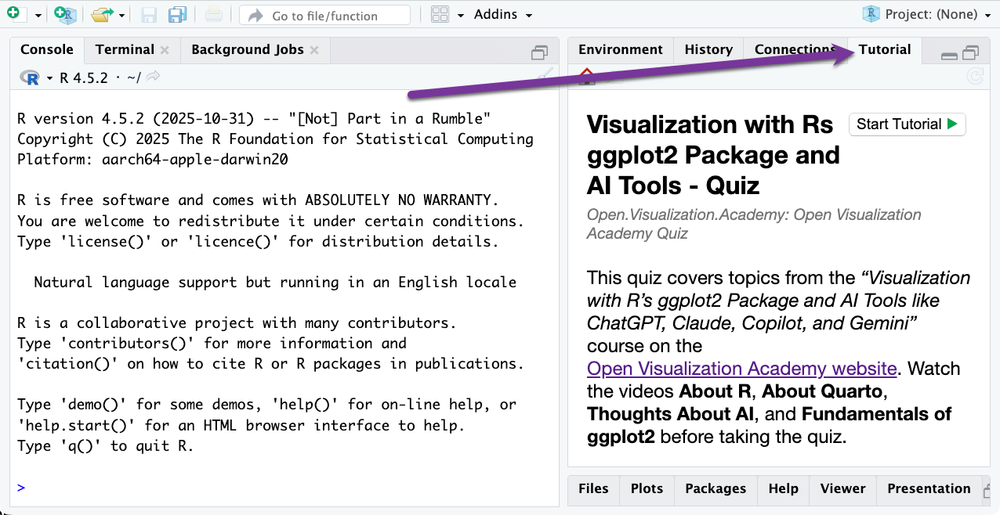
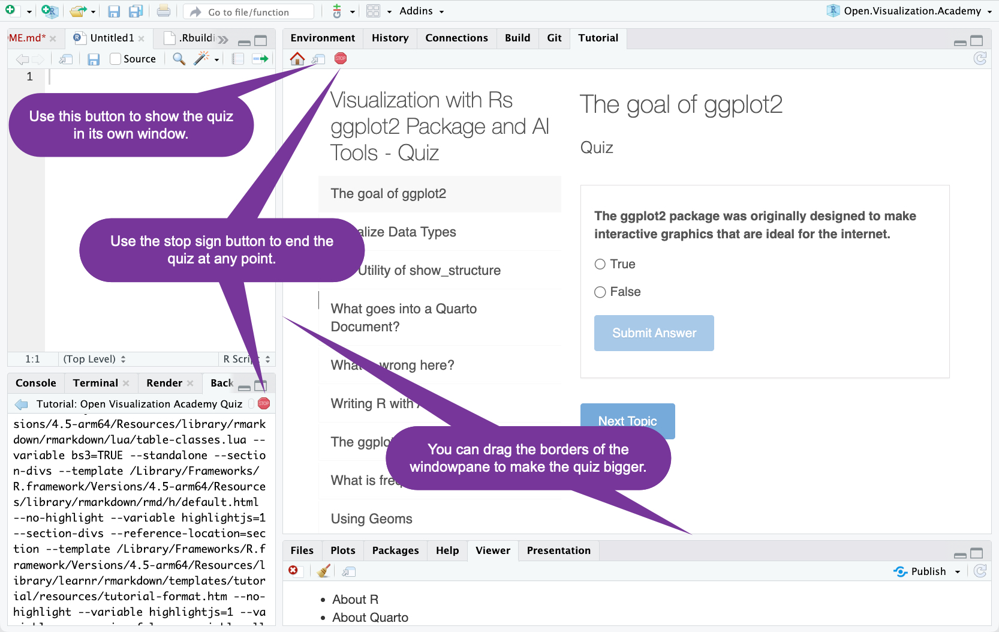
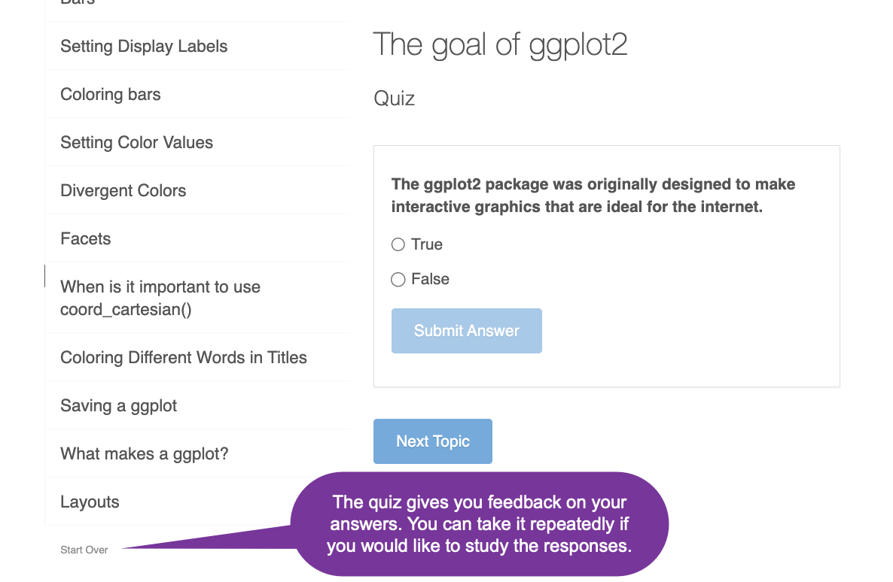

# Open.Visualization.Academy

This is a package to support class _Visualization with R's ggplot2 Package and AI Tools like ChatGPT, Claude, Copilot, and Gemini_ which is part of the [Open Visualization Academy]() project.

To install the package:

```r
# The easiest way to install Open.Visualization.Academy is to run:
install.packages("Open.Visualization.Academy")

# Or you can get the development version from GitHub:
# install.packages("pak")
pak::pak("RaymondBalise/Open.Visualization.Academy")
```

## About this Package

The `Open.Visualization.Academy` package contains:

1. A function called `show_structure()`, which prints a report describing a dataset.  It tries to not print sensitive data.  This is useful for when you are working with AI tools like ChatGPT, Claude, Copilot, and Gemini. To learn about it, run this line in the R Console:  
  `vignette("show_structure", package = "Open.Visualization.Academy")`.
2. Datasets named `laryngectomy` and `analysis`. To learn about them, run `?laryngectomy` or `?analysis` in the R Console.
3. A quiz which covers the material in the Open Visualization Academy class called _Visualization with R's ggplot2 Package and AI Tools like ChatGPT, Claude, Copilot, and Gemini_.

## About the Quiz

The _Visualization with R's ggplot2 Package and AI Tools like ChatGPT, Claude, Copilot, and Gemini_ course has four sections:

+ About R
+ About Quarto
+ Thoughts about AI
+ Fundamentals of ggplot2

Watch all of the videos before trying the quiz included here.

To use the quiz in RStudio, after installing the package, restart RStudio and then look in the Tutorial pane:



If you are working on a large screen, you can resize the quiz:



If you scroll to the bottom of the question list, you can start over.



If you are not working in RStudio, you can access the quiz by running this:

```r
learnr::run_tutorial("Open Visualization Academy Quiz", "Open.Visualization.Academy")
```